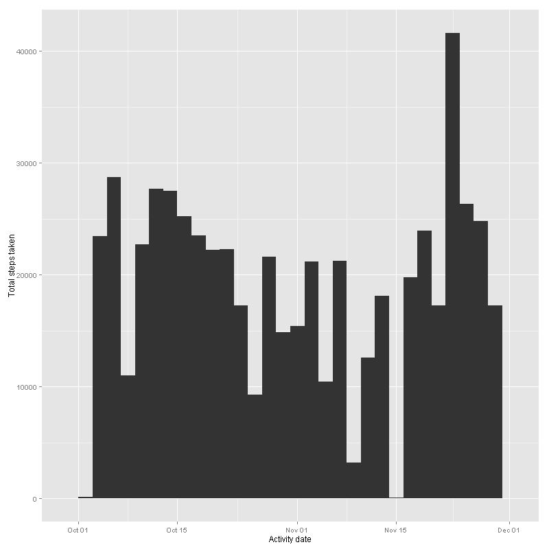
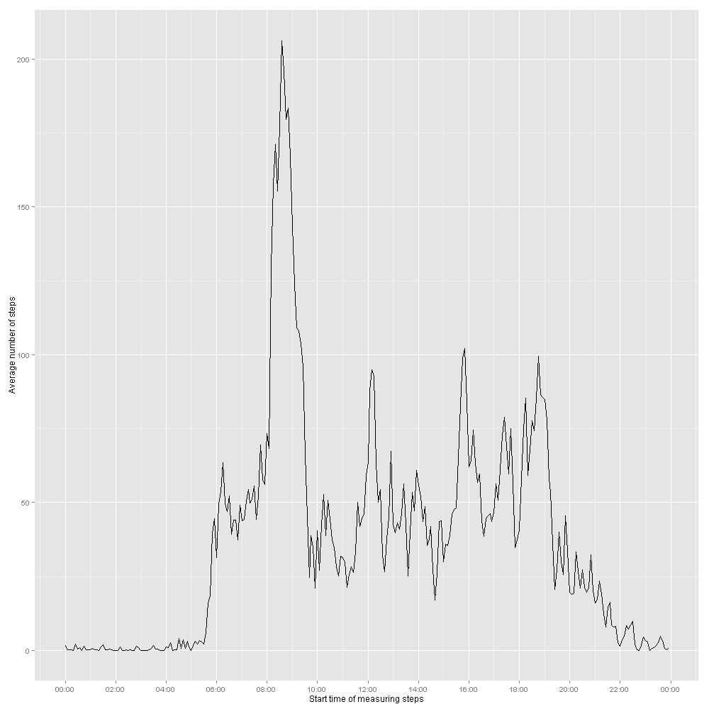
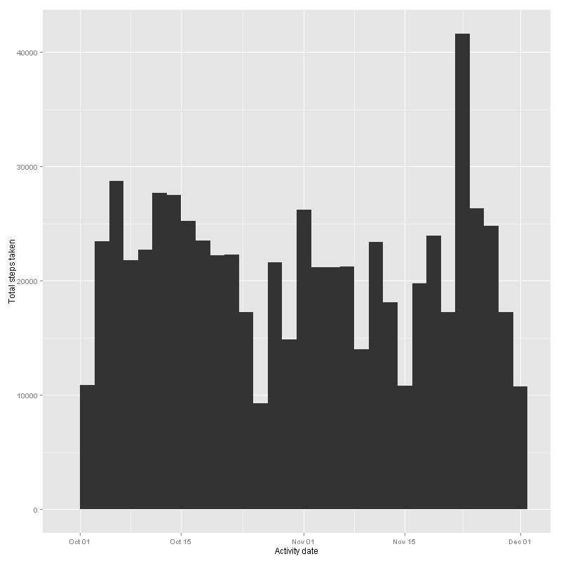
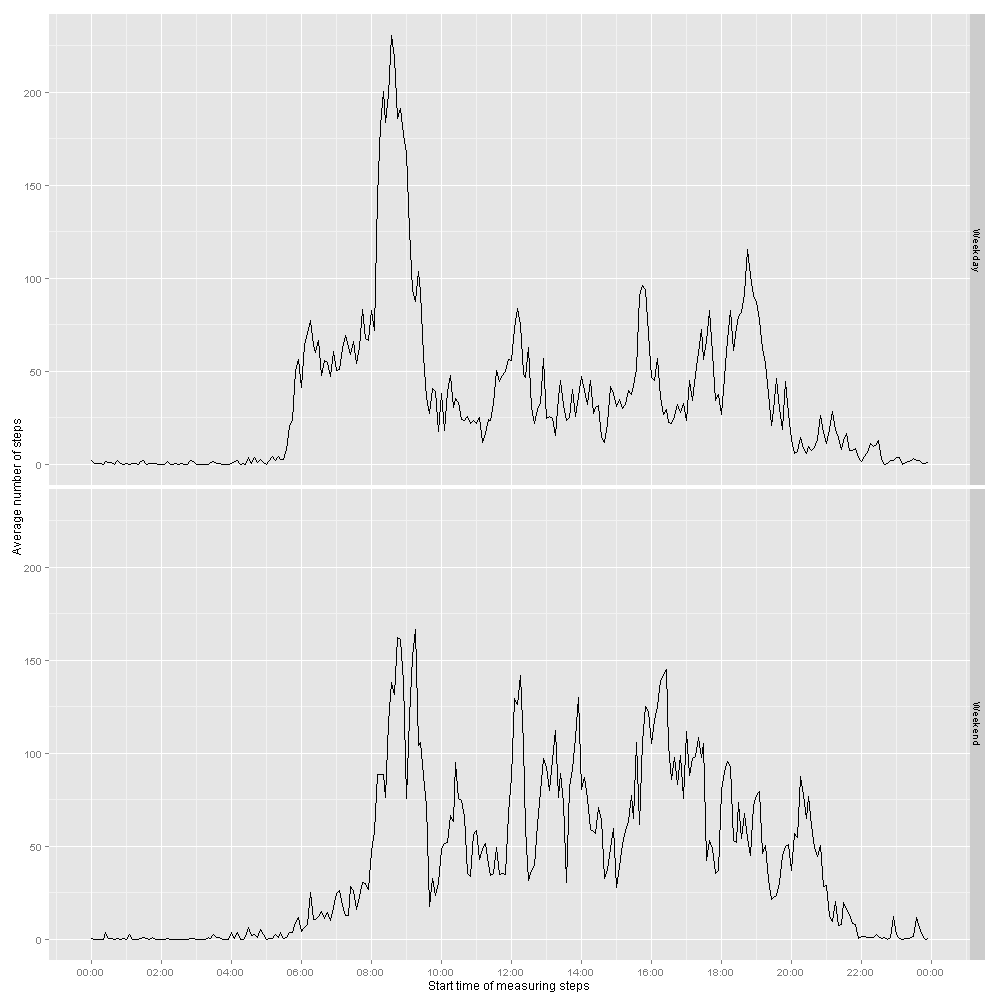

Reproducible Research: Peer Assessment 1
------------------------------------------


## Loading and preprocessing the data

 Unzip the data file
 
```{r, echo=TRUE}
unzip("activity.zip")
```

 Read the csv file into a data.frame 
 
```{r, echo=TRUE}
activity <- read.csv("activity.csv")
```

 Subset complete observations
 
```{r, echo=TRUE}
complete_activity = activity[complete.cases(activity),]
```

 Transform the data
 
```{r, echo=TRUE}
complete_activity <- transform(complete_activity, date = as.Date(complete_activity$date))
```

## What is mean total number of steps taken per day?

Sum the total number of steps taken per day, and generate a histogram
```{r, echo=TRUE}
sum_activity <- aggregate(steps~date, complete_activity, sum)
if (!require("ggplot2",character.only = TRUE))
    {
      install.packages("ggplot2",dep=TRUE)
      library(ggplot2)
    }
```
```{r,echo=TRUE,results='hide'}
figure.directory <- "figure"
if (!file.exists(figure.directory)){
  dir.create(figure.directory)
}

png(file.path(figure.directory,"figure1.png"), width = 800, height= 800)

ggplot(sum_activity) + geom_histogram(aes(x=date, weight=steps), binwidth =2) + xlab("Activity date") + ylab("Total steps taken")

dev.off()
```



 Mean of the total number of steps taken per day

```{r, echo=TRUE}
mean(sum_activity$steps)
```

 Median of the total number of steps taken per day

```{r, echo=TRUE}
median(sum_activity$steps)
```

## What is the average daily activity pattern?

A time series plot (i.e. type = "l") of the 5-minute interval (x-axis) and the average number of steps taken, averaged across all days (y-axis)
```{r, echo=TRUE}
## Create a dataframe with the average number of steps for each 5 minute interval
avg_interval_activity <- aggregate(steps~interval, complete_activity, mean)

## Add a column with the time from the interval
avg_interval_activity <- transform(avg_interval_activity, time_string = paste(as.character(as.integer(interval/100)), ":", as.character(as.integer(interval%%100)), sep = ""))

avg_interval_activity <- transform(avg_interval_activity, date_time =  as.POSIXct(paste("01.01.2014" , time_string, sep = " "), format = "%d.%m.%Y %H:%M"))
```
```{r,echo=TRUE,results='hide'}
## time series plot (i.e. type = "l") of the 5-minute interval (x-axis) and the
## average number of steps taken, averaged across all days (y-axis)

library(scales)

png(file.path(figure.directory,"figure2.png"), width = 1000, height= 1000)

ggplot(data = avg_interval_activity, aes(date_time,steps)) + 
    geom_line()+
    scale_x_datetime(labels = date_format("%H:%M"),breaks = "2 hour") +xlab("Start time of measuring steps") +ylab("Average number of steps")

dev.off()
```



 The 5-minute interval, that contains the maximum average number of steps

```{r, echo=TRUE}
avg_interval_activity[avg_interval_activity$steps == max(avg_interval_activity$steps),]$interval
```

## Imputing missing values

 Total number of rows with NA

```{r, echo=TRUE}
nrow(activity[!complete.cases(activity),])
```

### Strategy to fill missing data : Fill in the missing data from the mean for the 5- minute interval

Create a new dataset that is equal to the original dataset but with the missing data filled in with the mean for that 5-minute interval.

```{r,echo=TRUE}
## function for Average steps values for each 5-minute interval
getAverageSteps <- function(intervals){
    avg_steps <- vector()
    j <- 1
    for(i in intervals){
      avg_steps[j] <- avg_interval_activity[(avg_interval_activity$interval == i), ]$steps
     
      j <- j +1
    }
    avg_steps
}

##Copy initial values
activity_filled <- activity
##Fill missing values with with the mean for that 5-minute interval
activity_filled[!complete.cases(activity_filled),]$steps <- getAverageSteps(activity_filled[!complete.cases(activity_filled),]$interval)

```

Sum the total number of steps taken per day after filling missing values, and generate a histogram

```{r, echo=TRUE}
activity_filled <- transform(activity_filled, date = as.Date(activity_filled$date))
sum_activity_filled <- aggregate(steps~date, activity_filled, sum)
```
```{r,echo=TRUE,results='hide'}

png(file.path(figure.directory,"figure3.png"), width = 800, height= 800)

ggplot(sum_activity_filled) + geom_histogram(aes(x=date, weight=steps), binwidth = 2) + xlab("Activity date") + ylab("Total steps taken")

dev.off()
```


Mean of the total number of steps taken per day after filling missing values

```{r, echo=TRUE}
mean(sum_activity_filled$steps)
```

 Median of the total number of steps taken per day after filling missing values

```{r, echo=TRUE}
median(sum_activity_filled$steps)
```

## Are there differences in activity patterns between weekdays and weekends?

 Add factor of "Weekend" or "Weekday"

```{r,echo=TRUE}
days <- weekdays(activity_filled$date)

##function to mark Weekend or Weekday

WeekDayOrEnd <- function(days){
    dayOrEnd <- vector()
    j <- 0
    for(day in days){
        j <- j+1
        if(day == "Saturday" || day == "Sunday"){
            dayOrEnd[j] <- "Weekend"
        }
        else{
            dayOrEnd[j] <- "Weekday"
        }
    }
    dayOrEnd
}

activity_filled$dayOrEnd <- WeekDayOrEnd(days)

activity_filled <- transform(activity_filled, dayOrEnd = factor(dayOrEnd))

```

A time series plot (i.e. type = "l") of the 5-minute interval (x-axis) and the average number of steps taken, averaged across all days (y-axis)

```{r, echo=TRUE}
## Create a dataframe with the average number of steps for each 5 minute interval
avg_interval_activity_filled <- aggregate(steps ~ dayOrEnd +interval, activity_filled, mean)

## Add a column with the time from the interval
avg_interval_activity_filled <- transform(avg_interval_activity_filled, time_string = paste(as.character(as.integer(interval/100)), ":", as.character(as.integer(interval%%100)), sep = ""))

avg_interval_activity_filled <- transform(avg_interval_activity_filled, date_time =  as.POSIXct(paste("01.01.2014" , time_string, sep = " "), format = "%d.%m.%Y %H:%M"))
```

```{r,echo=TRUE,results='hide'}
## time series plot (i.e. type = "l") of the 5-minute interval (x-axis) and the
## average number of steps taken, averaged across all days (y-axis)

png(file.path(figure.directory,"figure4.png"), width = 1000, height= 1000)

ggplot(data = avg_interval_activity_filled, aes(date_time,steps)) + 
    geom_line()+
    scale_x_datetime(labels = date_format("%H:%M"),breaks = "2 hour") + facet_grid(dayOrEnd ~ .) + xlab("Start time of measuring steps") + ylab("Average number of steps")

dev.off()

```



